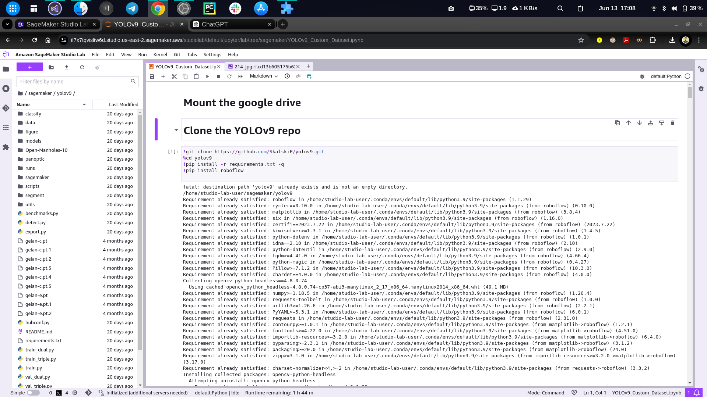

# Manhole Detection with YOLOv9

This project involves training a YOLOv9 model for manhole detection, building a Gradio app for demonstration, and deploying it on Hugging Face.

## Table of Contents

1. [Introduction](#introduction)
2. [Model Training](#model-training)
3. [Gradio App](#gradio-app)
4. [Deployment on Hugging Face](#deployment-on-hugging-face)
5. [Usage](#usage)
6. [Requirements](#requirements)
7. [Installation](#installation)
8. [Acknowledgments](#acknowledgments)
9. [License](#license)

## Introduction

This project aims to detect manholes using the YOLOv9 model. The trained model is integrated into a Gradio app, which provides an interactive interface for users to test the model. The app is deployed on Hugging Face Spaces for easy access and use.

## Model Training

The YOLOv9 model was trained on Amazon SageMaker Studio using a custom dataset of manhole images. The training process involved the following steps:

1. **Data Preparation**: Collected and annotated images of manholes.
2. **Model Configuration**: Configured the YOLOv9 model parameters and architecture.
3. **Training**: Trained the model on SageMaker Studio with the prepared dataset.
4. 


## Gradio App

A Gradio app was developed to provide an easy-to-use interface for testing the YOLOv9 model. The app allows users to upload images and get predictions on the presence and location of manholes.

## Deployment on Hugging Face

The Gradio app was deployed on Hugging Face Spaces, making it accessible to a wider audience. The deployment process involved:

1. **Preparing the App**: Ensuring the Gradio app is fully functional locally.
2. **Creating a Hugging Face Space**: Setting up a new space on Hugging Face.
3. **Uploading the App**: Uploading the Gradio app and its dependencies to the Hugging Face Space.

## Usage

To use the deployed Gradio app:

1. Visit the Hugging Face Space: [Gradio Manhole Detection App](#).
2. Upload an image containing a manhole.
3. Get predictions on the presence and location of the manhole.

## Requirements

- Python 3.7+
- Gradio
- YOLOv9
- AWS SageMaker Studio (for training)

## Installation

To run the Gradio app locally:

1. Clone the repository:
    ```bash
    git clone https://github.com/yourusername/manhole-detection-yolov9.git
    cd manhole-detection-yolov9
    ```

2. Install the required packages:
    ```bash
    pip install -r requirements.txt
    ```

3. Run the Gradio app:
    ```bash
    python app.py
    ```

## Acknowledgments

- [YOLOv9](#) for the object detection model.
- [Gradio](https://gradio.app/) for the interactive interface.
- [Hugging Face](https://huggingface.co/) for providing the deployment platform.
- [Amazon SageMaker Studio](https://aws.amazon.com/sagemaker/studio/) for model training.

## License

This project is licensed under the MIT License - see the [LICENSE](LICENSE) file for details.
