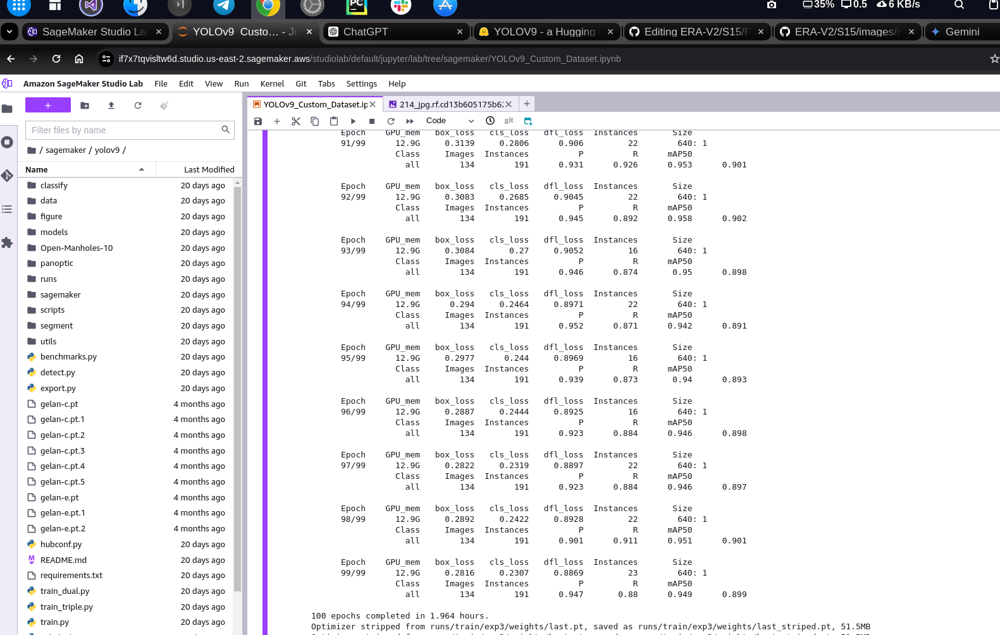
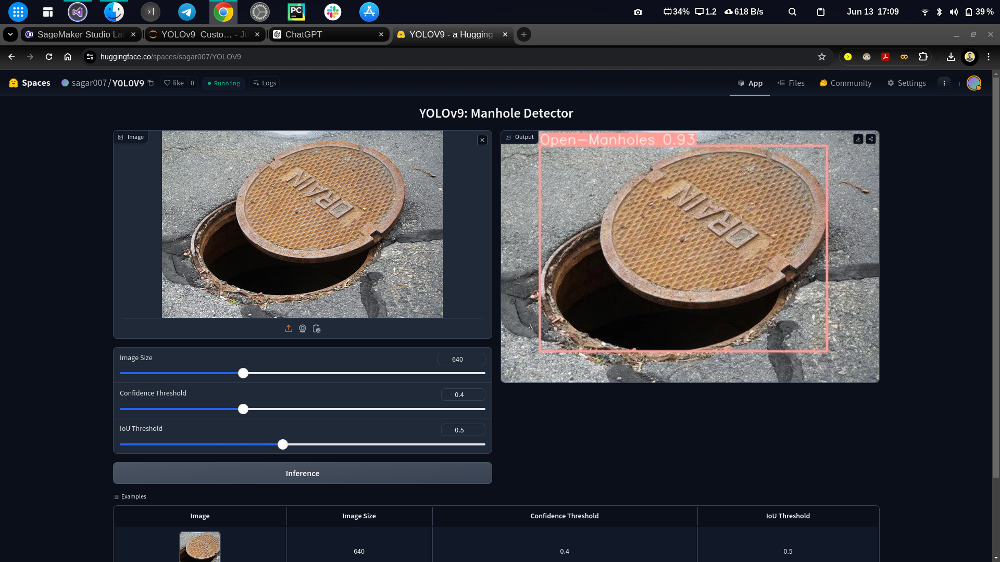

# Manhole Detection with YOLOv9

This project involves training a YOLOv9 model for manhole detection, building a Gradio app for demonstration, and deploying it on Hugging Face.

## Table of Contents

1. [Introduction](#introduction)
2. [Model Training](#model-training)
3. [Gradio App](#gradio-app)
4. [Deployment on Hugging Face](#deployment-on-hugging-face)
5. [Usage](#usage)
6. [Requirements](#requirements)
7. [Installation](#installation)
8. [Acknowledgments](#acknowledgments)
9. [License](#license)

## Introduction

This project aims to detect manholes using the YOLOv9 model. The trained model is integrated into a Gradio app, which provides an interactive interface for users to test the model. The app is deployed on Hugging Face Spaces for easy access and use.
oday’s deep learning methods focus on how to design the most appropriate objective functions so that the prediction results of the model can be closest to the ground truth. Meanwhile, an appropriate architecture that can facilitate acquisition of enough information for prediction has to be designed. Existing methods ignore a fact that when input data undergoes layer-by-layer feature extraction and spatial transformation, large amount of information will be lost. This paper will delve into the important issues of data loss when data is transmitted through deep networks, namely information bottleneck and reversible functions. We proposed the concept of programmable gradient information (PGI) to cope with the various changes required by deep networks to achieve multiple objectives. PGI can provide complete input information for the target task to calculate objective function, so that reliable gradient information can be obtained to update network weights. In addition, a new lightweight network architecture– Generalized Efficient Layer Aggregation Network (GELAN), based on gradient path planning is designed. GELAN’s architecture confirms that PGI has gained superior results on lightweight models. We verified the proposed GELAN and PGI on MS COCO dataset based object detection. The results show that GELAN only uses conventional convolution operators to achieve better parameter utilization than the state-of-the-art methods developed based on depth-wise convolution. PGI can be used for variety of models from lightweight to large. It can be used to obtain complete information, so that train-fromscratch models can achieve better results than state-of-theart models pre-trained using large datasets, the comparison results are shown in Figure 1. The source codes are at: https://github.com/WongKinYiu/yolov9.


## Model Training

The YOLOv9 model was trained on Amazon SageMaker Studio using a custom dataset of manhole images. The training process involved the following steps:

1. **Data Preparation**: Collected and annotated images of manholes.
2. **Model Configuration**: Configured the YOLOv9 model parameters and architecture.
3. **Training**: Trained the model on SageMaker Studio with the prepared dataset.

   

4.Traning steps

      Epoch    GPU_mem   box_loss   cls_loss   dfl_loss  Instances       Size
      88/99      12.9G     0.3369     0.2965      0.929         25        640: 1
                 Class     Images  Instances          P          R      mAP50   
                   all        134        191      0.884      0.928      0.946      0.895
   

      Epoch    GPU_mem   box_loss   cls_loss   dfl_loss  Instances       Size
      89/99      12.9G     0.3211      0.294     0.9137         23        640: 1
                 Class     Images  Instances          P          R      mAP50   
                   all        134        191      0.909      0.893      0.941      0.882
   

      Epoch    GPU_mem   box_loss   cls_loss   dfl_loss  Instances       Size
      90/99      12.9G     0.3215     0.2872     0.9162         20        640: 1
                 Class     Images  Instances          P          R      mAP50   
                   all        134        191      0.931      0.911      0.951      0.898
   

      Epoch    GPU_mem   box_loss   cls_loss   dfl_loss  Instances       Size
      91/99      12.9G     0.3139     0.2806      0.906         22        640: 1
                 Class     Images  Instances          P          R      mAP50   
                   all        134        191      0.931      0.926      0.953      0.901
   

      Epoch    GPU_mem   box_loss   cls_loss   dfl_loss  Instances       Size
      92/99      12.9G     0.3083     0.2685     0.9045         22        640: 1
                 Class     Images  Instances          P          R      mAP50   
                   all        134        191      0.945      0.892      0.958      0.902
   

      Epoch    GPU_mem   box_loss   cls_loss   dfl_loss  Instances       Size
      93/99      12.9G     0.3084       0.27     0.9052         16        640: 1
                 Class     Images  Instances          P          R      mAP50   
                   all        134        191      0.946      0.874       0.95      0.898
   

      Epoch    GPU_mem   box_loss   cls_loss   dfl_loss  Instances       Size
      94/99      12.9G      0.294     0.2464     0.8971         22        640: 1
                 Class     Images  Instances          P          R      mAP50   
                   all        134        191      0.952      0.871      0.942      0.891
   

      Epoch    GPU_mem   box_loss   cls_loss   dfl_loss  Instances       Size
      95/99      12.9G     0.2977      0.244     0.8969         16        640: 1
                 Class     Images  Instances          P          R      mAP50   
                   all        134        191      0.939      0.873       0.94      0.893
   

      Epoch    GPU_mem   box_loss   cls_loss   dfl_loss  Instances       Size
      96/99      12.9G     0.2887     0.2444     0.8925         16        640: 1
                 Class     Images  Instances          P          R      mAP50   
                   all        134        191      0.923      0.884      0.946      0.898
   

      Epoch    GPU_mem   box_loss   cls_loss   dfl_loss  Instances       Size
      97/99      12.9G     0.2822     0.2319     0.8897         22        640: 1
                 Class     Images  Instances          P          R      mAP50   
                   all        134        191      0.923      0.884      0.946      0.897
   

      Epoch    GPU_mem   box_loss   cls_loss   dfl_loss  Instances       Size
      98/99      12.9G     0.2892     0.2422     0.8928         22        640: 1
                 Class     Images  Instances          P          R      mAP50   
                   all        134        191      0.901      0.911      0.951      0.901
   

      Epoch    GPU_mem   box_loss   cls_loss   dfl_loss  Instances       Size
      99/99      12.9G     0.2816     0.2307     0.8869         23        640: 1
                 Class     Images  Instances          P          R      mAP50   
                   all        134        191      0.947       0.88      0.949      0.899
   


## Gradio App

A Gradio app was developed to provide an easy-to-use interface for testing the YOLOv9 model. The app allows users to upload images and get predictions on the presence and location of manholes.



## Deployment on Hugging Face

The Gradio app was deployed on Hugging Face Spaces, making it accessible to a wider audience. The deployment process involved:

1. **Preparing the App**: Ensuring the Gradio app is fully functional locally.
2. **Creating a Hugging Face Space**: Setting up a new space on Hugging Face.
3. **Uploading the App**: Uploading the Gradio app and its dependencies to the Hugging Face Space.
4. **Link** :https://huggingface.co/spaces/sagar007/YOLOV9

## Usage

To use the deployed Gradio app:

1. Visit the Hugging Face Space: [Gradio Manhole Detection App](#).
2. Upload an image containing a manhole.
3. Get predictions on the presence and location of the manhole.

## Requirements

- Python 3.7+
- Gradio
- YOLOv9
- AWS SageMaker Studio (for training)

## Installation

To run the Gradio app locally:

1. Clone the repository:
    ```bash
    git clone https://github.com/yourusername/manhole-detection-yolov9.git
    cd manhole-detection-yolov9
    ```

2. Install the required packages:
    ```bash
    pip install -r requirements.txt
    ```

3. Run the Gradio app:
    ```bash
    python app.py
    ```

## Acknowledgments

- [YOLOv9](#) for the object detection model.
- [Gradio](https://gradio.app/) for the interactive interface.
- [Hugging Face](https://huggingface.co/) for providing the deployment platform.
- [Amazon SageMaker Studio](https://aws.amazon.com/sagemaker/studio/) for model training.

## License

This project is licensed under the MIT License - see the [LICENSE](LICENSE) file for details.
