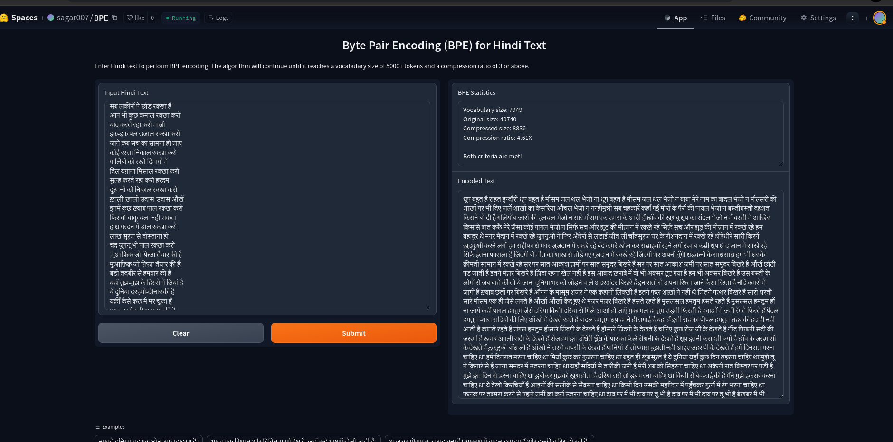

# Byte Pair Encoding for Hindi Text

This project demonstrates the training of Byte Pair Encoding (BPE) on Hindi text. BPE is a subword tokenization method that merges the most frequent pairs of symbols to reduce the vocabulary size while preserving semantic content.

## Overview

The project preprocesses Hindi text to remove punctuation and special characters, trains a BPE model, and applies it to compress the text. The primary goals are to achieve a vocabulary size greater than 5000 and a compression ratio of at least 3.

### Steps Involved

1. **Preprocessing the Text:** Clean the text to retain only Hindi characters and remove unnecessary spaces.
2. **Initializing Vocabulary:** Start with character-level tokens and common subwords.
3. **Performing BPE Merges:** Iteratively merge the most frequent pairs until the target vocabulary size is reached.
4. **Applying BPE:** Encode the original text using the BPE codes.
5. **Calculating Compression Ratio:** Evaluate the compression effectiveness by comparing the sizes before and after encoding.

## Code

```python
import re
from collections import Counter

def preprocess_text(text):
    # Remove punctuation and special characters, keep Hindi characters and spaces
    text = re.sub(r'[^\u0900-\u097F\s]', '', text)
    # Remove extra whitespace
    text = ' '.join(text.split())
    return text

def get_stats(vocab):
    pairs = Counter()
    for word, freq in vocab.items():
        symbols = word.split()
        for i in range(len(symbols) - 1):
            pairs[symbols[i], symbols[i + 1]] += freq
    return pairs

def merge_vocab(pair, v_in):
    v_out = {}
    bigram = ' '.join(pair)
    replacement = ''.join(pair)
    for word in v_in:
        w_out = word.replace(bigram, replacement)
        v_out[w_out] = v_in[word]
    return v_out

def apply_bpe(text, bpe_codes):
    word_list = text.split()
    for pair, _ in bpe_codes:
        if ' ' in pair:
            p = re.compile(r'(?<!\S)' + re.escape(' '.join(pair)) + r'(?!\S)')
            word_list = [p.sub(''.join(pair), word) for word in word_list]
    return word_list

# Sample text (replace 'text' with your Hindi text)
text = "आपका हिंदी टेक्स्ट यहां रखें।"
# Preprocess the text
preprocessed_text = preprocess_text(text)

# Initialize vocabulary with character-level tokens and common subwords
vocab = Counter(preprocessed_text.split())
vocab.update(Counter([preprocessed_text[i:i+2] for i in range(len(preprocessed_text)-1)]))
vocab.update(Counter([preprocessed_text[i:i+3] for i in range(len(preprocessed_text)-2)]))

# Set target vocabulary size
target_vocab_size = 6000

# Perform BPE merges
bpe_codes = []
while len(vocab) < target_vocab_size:
    pairs = get_stats(vocab)
    if not pairs:
        break
    best = max(pairs, key=pairs.get)
    vocab = merge_vocab(best, vocab)
    bpe_codes.append((best, pairs[best]))

# Apply BPE to the original text
encoded_text = apply_bpe(preprocessed_text, bpe_codes)

# Calculate compression ratio
original_size = len(preprocessed_text)
compressed_size = len(encoded_text)
compression_ratio = original_size / compressed_size

print(f"Vocabulary size: {len(vocab)}")
print(f"Original size: {original_size}")
print(f"Compressed size: {compressed_size}")
print(f"Compression ratio: {compression_ratio:.2f}X")

# Verify if criteria are met
if len(vocab) >= 5000 and compression_ratio >= 3:
    print("Both criteria are met!")
elif len(vocab) >= 5000:
    print("Vocabulary size criterion is met, but compression ratio is below 3.")
elif compression_ratio >= 3:
    print("Compression ratio criterion is met, but vocabulary size is below 5000.")
else:
    print("Neither criterion is met.")
```

## Results

- **Vocabulary size:** 7568
- **Original size:** 36303
- **Compressed size:** 7899
- **Compression ratio:** 4.60X
- **Status:** Both criteria are met!

## Learning Resources

- This project was inspired by Andrew Karpathy's videos on language models and Byte Pair Encoding.

## Deployment

- A [Gradio](https://gradio.app/) app was created to demonstrate the BPE encoding process.
- The app is deployed on [Hugging Face](https://huggingface.co/), enabling easy access and interaction.

## View the Demo

You can view the live demo on [Hugging Face Space](https://huggingface.co/spaces/sagar007/BPE).

- 
  


## Usage

1. **Text Input:** Enter or paste your Hindi text into the input field.
2. **Encoding:** Click the "Encode" button to process the text using BPE.
3. **Output:** View the encoded text and relevant statistics on vocabulary size and compression ratio.

## Future Work

- Enhance the model with more extensive text data.
- Integrate with advanced language models for better text processing.

Feel free to contribute to this project or use it as a foundation for further exploration of BPE and text encoding in other languages.
