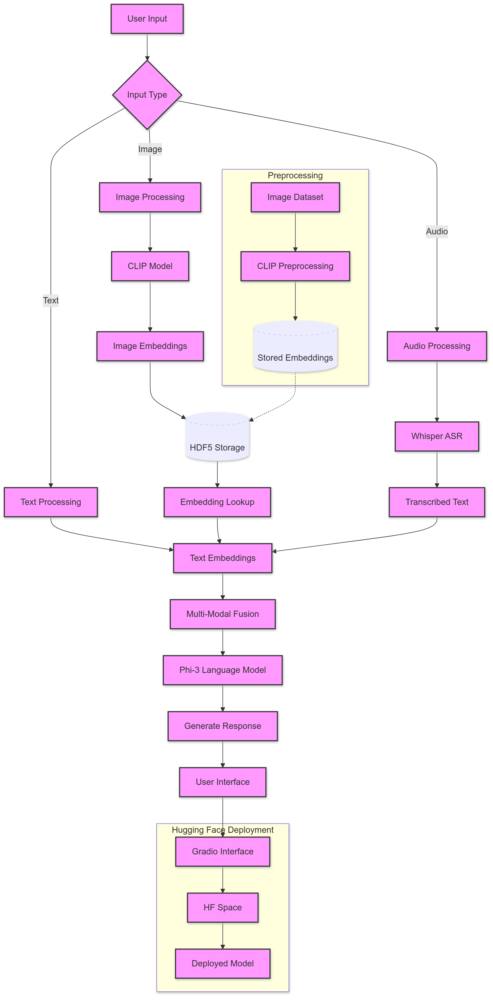

# Multi-Modal AI Assistant

## Overview

This project implements a ChatGPT-like AI assistant capable of processing and responding to text, image, and audio inputs. It integrates state-of-the-art models for each modality to provide coherent, context-aware responses.



## Features

- Multi-modal input processing: Text, images, and audio
- ChatGPT-style interface for user interaction
- CLIP integration for image understanding
- Whisper ASR for speech-to-text conversion
- Phi-2 as the base language model for response generation
- Efficient handling of image embeddings through preprocessing and storage
- Deployed on Hugging Face Spaces for easy access and sharing

## Installation

1. Clone the repository:
   ```
   git clone https://github.com/your-username/multi-modal-ai-assistant.git
   cd multi-modal-ai-assistant
   ```

2. Create a virtual environment and activate it:
   ```
   python -m venv venv
   source venv/bin/activate  # On Windows, use `venv\Scripts\activate`
   ```

3. Install the required packages:
   ```
   pip install -r requirements.txt
   ```

4. Download the necessary model weights:
   ```
   python download_models.py
   ```

## Usage

1. Preprocess image embeddings:
   ```
   python preprocess_images.py --image_dir path/to/your/images --output_file embeddings.h5
   ```

2. Run the local development server:
   ```
   python app.py
   ```

3. Open your web browser and navigate to `http://localhost:7860` to interact with the assistant.

## Deployment

This project is deployed on Hugging Face Spaces. You can access the live demo [here](link_to_your_huggingface_space).

To deploy your own instance:

1. Create a new Space on Hugging Face
2. Connect your GitHub repository to the Space
3. Configure the build process as specified in the `README.md` file of the Space

## Project Structure

```
multi-modal-ai-assistant/
├── app.py                 # Main application file
├── preprocess_images.py   # Script for preprocessing image embeddings
├── models/
│   ├── clip_model.py      # CLIP model integration
│   ├── whisper_model.py   # Whisper ASR integration
│   └── phi2_model.py      # Phi-2 language model integration
├── utils/
│   ├── text_utils.py      # Text processing utilities
│   ├── image_utils.py     # Image processing utilities
│   └── audio_utils.py     # Audio processing utilities
├── data/
│   └── embeddings.h5      # Preprocessed image embeddings
├── tests/                 # Unit and integration tests
├── requirements.txt       # Project dependencies
└── README.md              # This file
```

## Contributing

Contributions are welcome! Please feel free to submit a Pull Request.

## License

This project is licensed under the MIT License - see the [LICENSE](LICENSE) file for details.

## Acknowledgements

- This project was developed with assistance from an AI language model.
- Special thanks to the creators of CLIP, Whisper, and Phi-2 for their amazing models.

## Contact

For any queries, please open an issue in this repository or contact [your-email@example.com](mailto:your-email@example.com).