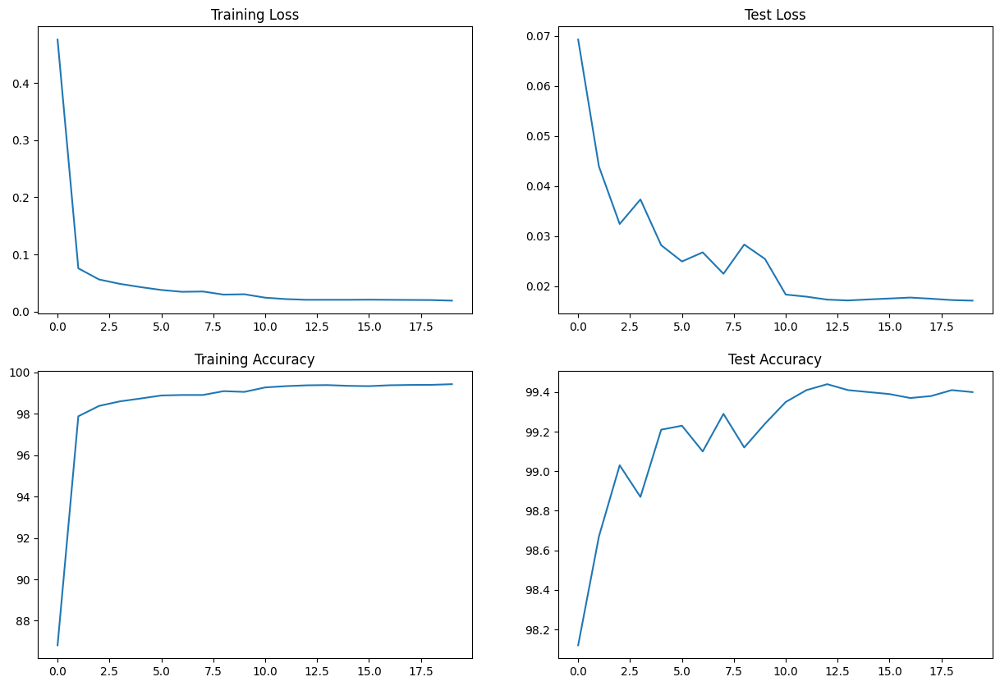

**Project Title:** Understanding Backpropagation and Building a Super Smart Image Recognizer

**What is this project about?**

* Imagine a computer program that can learn to recognize images of things, like cats, dogs, or handwritten numbers. Sounds kind of like magic, right? 
* This project is about understanding how a computer can "teach itself" to do this.  Let's break it down into simple steps!

**Part 1: Backpropagation in Excel**

1. **What is Backpropagation?** 
   * Think of it like a super smart detective that helps the computer adjust its "guesses" to get better at recognizing images.
   * It's a bit like playing a guessing game where the computer tries to tell what's in a picture, and backpropagation helps make those guesses smarter with each round.

2. **Excel Time!**
   * We'll use an Excel sheet to see backpropagation in action. It will have lots of numbers, but don't worry – we'll explain it step by step.
   * Think of it like solving a math problem where you correct the computer's answers each time to make it better at solving similar problems.
   * 

3. **Learning Rate**
   * This is a special number that controls how quickly our computer detective learns. Think of it like the size of steps it takes with each guess.
   * We'll try different learning rates and see how the computer's guesses change.

4.This part involves using MS Excel to perform backprop on a arbitrary defined Neural network.
  *

**Part 2: Building a Super Accurate Image Recognizer**

1. **Goal:** Make our computer program get almost everything right (like 99.4%!) when it guesses what's in an image.

2. **Tools**
   * **Kernels:** Think of these like special magnifying glasses for our computer to look at details in the image.
   * **Batch Normalization:** Helps the computer learn in smaller groups, making things faster.
   * **Dropout:** A cool trick that tells our computer to ignore some clues, making it learn even better!
   * **And More!** There are even more special tricks that we can add to make our image recognizer the best it can be.

3. **The Code:** I'll show you examples of how we can use these tools in a simple computer program that learns. Don't worry if you don't understand everything, the focus is on the big picture of how things fit together.

4. **Challenge Time!** Your mission is to build your own image recognizer using these tools. Experiment, try different things, it's like playing detective with the computer! 

**Let's get started!** 
[Include instructions to find the Excel sheet and project code on GitHub] 

**Remember, you are awesome, and learning this stuff is amazing!** 
 
Let me know if you'd like adjustments or additional explanations to make it even more understandable for a 12-year-old. 
