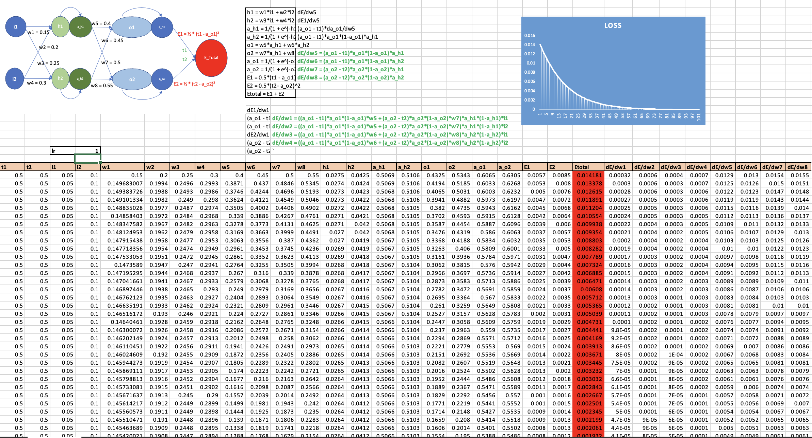
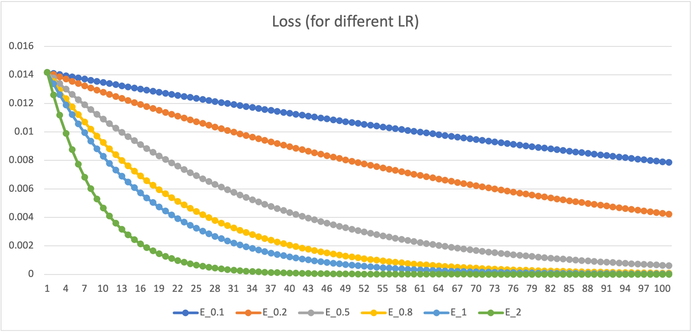

**Project Title:** Understanding Backpropagation and Building a Super Smart Image Recognizer

**What is this project about?**

* Imagine a computer program that can learn to recognize images of things, like cats, dogs, or handwritten numbers. Sounds kind of like magic, right? 
* This project is about understanding how a computer can "teach itself" to do this.  Let's break it down into simple steps!

**Part 1: Backpropagation in Excel**

1. **What is Backpropagation?** 
   * Think of it like a super smart detective that helps the computer adjust its "guesses" to get better at recognizing images.
   * It's a bit like playing a guessing game where the computer tries to tell what's in a picture, and backpropagation helps make those guesses smarter with each round.

2. **Excel Time!**
   * We'll use an Excel sheet to see backpropagation in action. It will have lots of numbers, but don't worry – we'll explain it step by step.
   * Think of it like solving a math problem where you correct the computer's answers each time to make it better at solving similar problems.
   * 

3. **Learning Rate**
   * This is a special number that controls how quickly our computer detective learns. Think of it like the size of steps it takes with each guess.
   * We'll try different learning rates and see how the computer's guesses change.

4.This part involves using MS Excel to perform backprop on a arbitrary defined Neural network.
  *

## Part 2

### Target
1. Accuracy > 99.4%
2. Number of Parameters < 20k
3. Num Epochs < 20

### Structure
```
----------------------------------------------------------------
        Layer (type)               Output Shape         Param #
================================================================
            Conv2d-1           [-1, 16, 26, 26]             160
              ReLU-2           [-1, 16, 26, 26]               0
       BatchNorm2d-3           [-1, 16, 26, 26]              32
            Conv2d-4           [-1, 16, 24, 24]           2,320
              ReLU-5           [-1, 16, 24, 24]               0
       BatchNorm2d-6           [-1, 16, 24, 24]              32
            Conv2d-7           [-1, 30, 22, 22]           4,350
              ReLU-8           [-1, 30, 22, 22]               0
       BatchNorm2d-9           [-1, 30, 22, 22]              60
           Conv2d-10           [-1, 30, 11, 11]             930
             ReLU-11           [-1, 30, 11, 11]               0
      BatchNorm2d-12           [-1, 30, 11, 11]              60
           Conv2d-13             [-1, 16, 9, 9]           4,336
             ReLU-14             [-1, 16, 9, 9]               0
      BatchNorm2d-15             [-1, 16, 9, 9]              32
           Conv2d-16             [-1, 16, 7, 7]           2,320
             ReLU-17             [-1, 16, 7, 7]               0
      BatchNorm2d-18             [-1, 16, 7, 7]              32
           Conv2d-19             [-1, 32, 5, 5]           4,640
             ReLU-20             [-1, 32, 5, 5]               0
      BatchNorm2d-21             [-1, 32, 5, 5]              64
        AvgPool2d-22             [-1, 32, 1, 1]               0
           Linear-23                   [-1, 10]             330
================================================================
Total params: 19,698
Trainable params: 19,698
Non-trainable params: 0
----------------------------------------------------------------
```

1. **Goal:** Make our computer program get almost everything right (like 99.4%!) when it guesses what's in an image.

2. **Tools**
   * **Kernels:** Think of these like special magnifying glasses for our computer to look at details in the image.
   * **Batch Normalization:** Helps the computer learn in smaller groups, making things faster.
   * **Dropout:** A cool trick that tells our computer to ignore some clues, making it learn even better!
   * **And More!** There are even more special tricks that we can add to make our image recognizer the best it can be.

3.##Traning stats
```
Adjusting learning rate of group 0 to 5.0000e-02.
Epoch 1
Train: Loss=0.0681 Batch_id=117 Accuracy=86.82: 100%|██████████| 118/118 [00:18<00:00,  6.23it/s]
Test set: Average loss: 0.0693, Accuracy: 9812/10000 (98.12%)

Adjusting learning rate of group 0 to 5.0000e-02.
Epoch 2
Train: Loss=0.0246 Batch_id=117 Accuracy=97.87: 100%|██████████| 118/118 [00:19<00:00,  6.10it/s]
Test set: Average loss: 0.0439, Accuracy: 9867/10000 (98.67%)

Adjusting learning rate of group 0 to 5.0000e-02.
Epoch 3
Train: Loss=0.0154 Batch_id=117 Accuracy=98.37: 100%|██████████| 118/118 [00:20<00:00,  5.83it/s]
Test set: Average loss: 0.0324, Accuracy: 9903/10000 (99.03%)

Adjusting learning rate of group 0 to 5.0000e-02.
Epoch 4
Train: Loss=0.1528 Batch_id=117 Accuracy=98.59: 100%|██████████| 118/118 [00:20<00:00,  5.67it/s]
Test set: Average loss: 0.0373, Accuracy: 9887/10000 (98.87%)

Adjusting learning rate of group 0 to 5.0000e-02.
Epoch 5
Train: Loss=0.0254 Batch_id=117 Accuracy=98.73: 100%|██████████| 118/118 [00:20<00:00,  5.67it/s]
Test set: Average loss: 0.0282, Accuracy: 9921/10000 (99.21%)

Adjusting learning rate of group 0 to 5.0000e-02.
Epoch 6
Train: Loss=0.0129 Batch_id=117 Accuracy=98.88: 100%|██████████| 118/118 [00:19<00:00,  5.92it/s]
Test set: Average loss: 0.0249, Accuracy: 9923/10000 (99.23%)

Adjusting learning rate of group 0 to 5.0000e-02.
Epoch 7
Train: Loss=0.0296 Batch_id=117 Accuracy=98.90: 100%|██████████| 118/118 [00:20<00:00,  5.77it/s]
Test set: Average loss: 0.0268, Accuracy: 9910/10000 (99.10%)

Adjusting learning rate of group 0 to 5.0000e-02.
Epoch 8
Train: Loss=0.0591 Batch_id=117 Accuracy=98.90: 100%|██████████| 118/118 [00:20<00:00,  5.74it/s]
Test set: Average loss: 0.0225, Accuracy: 9929/10000 (99.29%)

Adjusting learning rate of group 0 to 5.0000e-02.
Epoch 9
Train: Loss=0.0440 Batch_id=117 Accuracy=99.08: 100%|██████████| 118/118 [00:20<00:00,  5.82it/s]
Test set: Average loss: 0.0283, Accuracy: 9912/10000 (99.12%)

Adjusting learning rate of group 0 to 5.0000e-02.
Epoch 10
Train: Loss=0.0201 Batch_id=117 Accuracy=99.05: 100%|██████████| 118/118 [00:19<00:00,  6.01it/s]
Test set: Average loss: 0.0254, Accuracy: 9924/10000 (99.24%)

Adjusting learning rate of group 0 to 5.0000e-03.
Epoch 11
Train: Loss=0.0151 Batch_id=117 Accuracy=99.27: 100%|██████████| 118/118 [00:20<00:00,  5.82it/s]
Test set: Average loss: 0.0183, Accuracy: 9935/10000 (99.35%)

Adjusting learning rate of group 0 to 5.0000e-03.
Epoch 12
Train: Loss=0.0069 Batch_id=117 Accuracy=99.33: 100%|██████████| 118/118 [00:20<00:00,  5.74it/s]
Test set: Average loss: 0.0179, Accuracy: 9941/10000 (99.41%)

Adjusting learning rate of group 0 to 5.0000e-03.
Epoch 13
Train: Loss=0.0069 Batch_id=117 Accuracy=99.37: 100%|██████████| 118/118 [00:20<00:00,  5.75it/s]
Test set: Average loss: 0.0173, Accuracy: 9944/10000 (99.44%)

Adjusting learning rate of group 0 to 5.0000e-03.
Epoch 14
Train: Loss=0.0239 Batch_id=117 Accuracy=99.38: 100%|██████████| 118/118 [00:19<00:00,  5.94it/s]
Test set: Average loss: 0.0171, Accuracy: 9941/10000 (99.41%)

Adjusting learning rate of group 0 to 5.0000e-03.
Epoch 15
Train: Loss=0.0081 Batch_id=117 Accuracy=99.34: 100%|██████████| 118/118 [00:20<00:00,  5.87it/s]
Test set: Average loss: 0.0174, Accuracy: 9940/10000 (99.40%)

Adjusting learning rate of group 0 to 5.0000e-03.
Epoch 16
Train: Loss=0.0081 Batch_id=117 Accuracy=99.33: 100%|██████████| 118/118 [00:20<00:00,  5.71it/s]
Test set: Average loss: 0.0175, Accuracy: 9939/10000 (99.39%)

Adjusting learning rate of group 0 to 5.0000e-03.
Epoch 17
Train: Loss=0.0258 Batch_id=117 Accuracy=99.37: 100%|██████████| 118/118 [00:20<00:00,  5.73it/s]
Test set: Average loss: 0.0177, Accuracy: 9937/10000 (99.37%)

Adjusting learning rate of group 0 to 5.0000e-03.
Epoch 18
Train: Loss=0.0400 Batch_id=117 Accuracy=99.39: 100%|██████████| 118/118 [00:26<00:00,  4.47it/s]
Test set: Average loss: 0.0175, Accuracy: 9938/10000 (99.38%)

Adjusting learning rate of group 0 to 5.0000e-03.
Epoch 19
Train: Loss=0.0330 Batch_id=117 Accuracy=99.39: 100%|██████████| 118/118 [00:20<00:00,  5.63it/s]
Test set: Average loss: 0.0172, Accuracy: 9941/10000 (99.41%)

Adjusting learning rate of group 0 to 5.0000e-03.
Epoch 20
Train: Loss=0.0101 Batch_id=117 Accuracy=99.42: 100%|██████████| 118/118 [00:20<00:00,  5.89it/s]
Test set: Average loss: 0.0171, Accuracy: 9940/10000 (99.40%)
```
### Performance Curve


